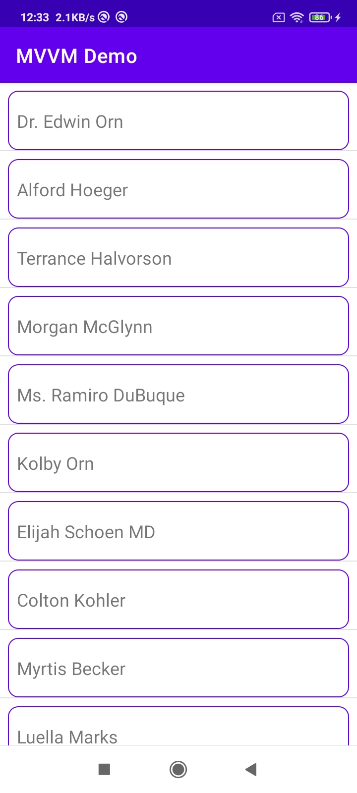

#Android MVVM Demo App

 

    

 

## Architecture
* Built with MVVM

## Built With 🛠
- [Kotlin](https://kotlinlang.org/) - Kotlin is a popular language for Android development.
- [RxJava](https://github.com/ReactiveX/RxJava) -RxJava is a Java VM implementation of Reactive Extensions: a library for composing asynchronous 
- [LiveData](https://developer.android.com/topic/libraries/architecture/livedata) - LiveData is an observable data holder class. 

